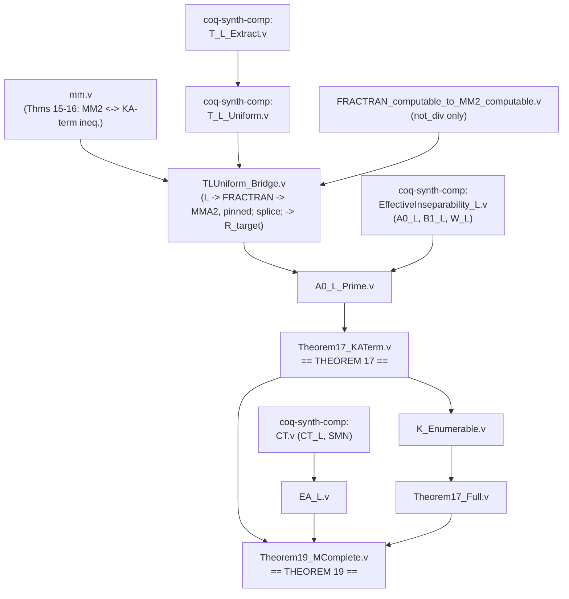

# Status update: Theorems 17, 18, and 19 closed

*2026-08-07, prepared for advisor meeting*

## 1. Bottom line

- **Theorem 17** (effective inseparability): **done, fully axiom-free.**
- **Theorem 18** (plain undecidability): an immediate corollary of Theorem 17
  (disjoint + a witness function implies no decidable separator); not
  separately formalized as its own theorem since there was nothing left to
  add.
- **Theorem 19** (Sigma^0_1-completeness, matching the paper's own remark
  that it adapted Kuznetsov's ICTAC 2023 argument): **done, conditional on
  two named, standard hypotheses** (`CT_L`, `MP` — Section 4 explains
  exactly why each is needed and where). Nothing else in the entire
  development uses an axiom.

Everything below is checked, not asserted: every theorem's `Print
Assumptions` output is either "closed under the global context" (fully
axiom-free) or lists exactly `CT_L`/`MP` and nothing else.

## 2. How the register-packing blocker (from the 8/4 update) actually got resolved

Short version: it wasn't solved, it was routed around.

The 8/4 blocker was building `η(i,j)`, a standalone MM2 program for a race
between two candidates, callable from `mm.v`'s raw calling convention
(`(1,(y,0))`, `y` sitting unencoded in a register). The obstruction was that
the race had been built via `MM2_computable`'s FRACTRAN-routed compiler
chain, whose own convention represents a multi-argument input via
prime-power packing (`qs(4)^y`), and no MM2 program can compute that packing
from a raw, live register value with only two registers (decrement-and-test
is the only way to read a register, and it destroys the value as it reads
it — the construction needs a register that is simultaneously "the still-
live loop counter" and "provably drained to zero," which is a genuine
conflict, not a missing trick).

Two independent lines of investigation confirmed this was a real dead end,
not a skill issue:

- A direct 2-register hand-construction lands on exactly one unavoidable
  `admit`, isolating the obstruction precisely (`MM2_ExpK_Attempt.v` — since
  removed from the working tree as a dead end, but still recoverable from
  git history, commit `a39ead3`).
- A literature check (Minsky's own 1967 universality theorem, and
  Gregušová–Korec 1979) confirmed the *standard* "2-counter machines are
  Turing-complete" results all assume the input arrives already
  Gödel-encoded — they don't solve "convert a raw unary input to a packed
  encoding at runtime" either, for the same underlying reason. This is
  worth a note in the paper's own related-work section: it's a small,
  citable correction to how that universality result usually gets
  characterized informally.

The way out was to stop routing through `MM2_computable`'s FRACTRAN-based,
numeric-vector convention at all. Instead, the whole computability argument
was rebuilt on top of `T_L` — Rocq's own step-indexed interpreter for its
`L` (call-by-value lambda calculus) language, already provided by the
sibling `coq-synthetic-computability` project. A *single* `L`-program per
problem instance doesn't need prime-power packing in the first place, so
the packing mismatch simply never arises. This did mean redoing work that
had already been built on the FRACTRAN-routed convention (the earlier race
construction, `SMN_MM2.v`'s family — still in the repo, still compiles,
just no longer on the critical path), but the replacement route turned out
to need far less machinery overall.

## 3. The file-by-file path

Both repos are pinned to the same toolchain and developed in lockstep (see
`flake.nix` in each). `Undecidability/` (the "kacc" project) holds
everything specific to Kleene algebra and the MM2 encoding.
`coq-synthetic-computability/` is a general-purpose synthetic
computability library this project depends on and extends; its `Models/`
and `ReducibilityDegrees/` directories hold the general-purpose
computability machinery.



(`FRACTRAN_computable_to_MM2_computable.v` also proves a full, self-contained
`FRACTRAN_computable -> MM2_computable` compiler, but that specific result
isn't on this path — see the note after step 3 below.)

**Algebraic core** (`Undecidability/`, unchanged since early August, done
weeks ago):

- `utils.v`, `algebra.v`, `pre_ka.v`, `enumerable.v`, `lang.v`, `automata.v`,
  `repr_rel.v`, `bounded_output.v` — the paper's own pre-Kleene-algebra
  framework (Definitions/Lemmas up through Lemma 34).
- **`mm.v`** — encodes two-counter (MM2) Minsky machines as KA terms
  (Definitions 11–13) and proves the soundness/completeness pair
  (`mm2_R_completeness`/`mm2_R_soundness`, the paper's Theorems 15–16)
  connecting MM2 reachability to a KA-term inequality `red_lb ⊑ red_ub`.
  Everything below is built on top of this file, untouched.

**The route through `T_L` to a KA-term-level problem instance**
(new this arc):

1. **`coq-synthetic-computability/theories/Models/T_L_Extract.v`** — made
   `T_L`/`enum_closed` (the step-indexed `L`-interpreter) genuinely
   extractable, via three narrow, non-obvious fixes to how `unembed` and
   recursive functions over `L`-terms had to be shaped. This had been the
   actual blocker before the register-packing detour was even attempted.
2. **`coq-synthetic-computability/theories/Models/T_L_Uniform.v`** — builds
   a single, uniform `L`-program (`s_TL`) that, given `(c, y)`, computes
   `T_L c y`. "Uniform" matters: it avoids needing a separate program per
   problem instance, which would have needed a choice principle.
3. **`Undecidability/TLUniform_Bridge.v`** — compiles that `L`-program all
   the way to `FRACTRAN_computable` via the library's existing
   `L → MMA → TM → BSM → MM → FRACTRAN` chain (the same chain the 8/4
   update used, just now applied to something that doesn't need the
   packing convention to be *runtime-computed*), then re-derives the
   FRACTRAN-to-MMA2 compilation itself with a *pinned* stop position
   (`FRACTRAN_computable_to_MMA2_pinned`) rather than reusing the
   library-style existential form, which doesn't expose the concrete
   position the next step needs to splice code after. Then splices the
   resulting divisibility-encoded output convention into `mm.v`'s exact
   `(0,(0,0))`-halting convention, all the way through to `R_target`
   (`R_TL_R_target_connection`) — the actual bridge from "T_L converges to
   a value" to "the KA-term inequality holds." The one piece it borrows
   rather than re-deriving is a small number-theoretic lemma, `not_div`
   (`Undecidability/FRACTRAN_computable_to_MM2_computable.v`), needed for
   the same divisibility argument in both places.

   *A deliberately-kept predecessor*: an earlier file, `TLUniform_MM2.v`,
   independently compiles the same `L`-program all the way to a
   fully-packaged `MM2_computable` witness (`R_TL_MM2_computable`).
   Nothing downstream actually consumes that witness as a term —
   `TLUniform_Bridge.v` does its own from-scratch pinned compilation
   instead — and the reason why is itself the interesting part: the
   packaged `MM2_computable`/`MMA2_computable` conclusion is Qed-opaque
   about exactly where the compiled program stops, and the splice
   construction needs that position exposed, not just known to exist, to
   know where to append its divides-test code. This was first found by
   checking "does this file compile" and "is this file imported," which
   missed it, since both were true despite the witness being unused — the
   real check needed is "is anything the file defines actually referenced
   downstream." The file was briefly removed on exactly that basis, then
   the removal was reverted once it became clear this wasn't an unrelated
   dead branch but the direct, intended predecessor to the pinned
   re-derivation, with a citable finding attached (Qed-opacity of an
   existential blocking a splice that needs to know a concrete position).
   It's kept in the tree for that reason — see `TLUniform_MM2.v`'s own
   header comment — with two open questions: whether the existing
   library proof could be strengthened to expose the pinned position
   directly instead of `TLUniform_Bridge.v` re-deriving it from scratch,
   and whether this discovery arc is worth a beat in the paper.
4. **`coq-synthetic-computability/theories/Models/EffectiveInseparability_L.v`**
   (pre-existing) — supplies `A0_L`/`B1_L`/`W_L` and the base
   effective-inseparability fact `eff_insep_A0_B1_L`, built via a
   self-referential diagonal race carried out natively in `L` (this is
   where `L`'s own recursion theorem does the work an earlier attempt was
   trying to get from an exponentiation subroutine).
5. **`Undecidability/A0_L_Prime.v`** — lifts that base fact one level, to a
   superset `A0_L'` still disjoint from `B1_L` and still enumerable, using
   the step-indexed MM2 simulator (`EffectiveInseparability_MM2.v`) rather
   than `R_target` directly. (`R_target`/`red_leq` is a *safety* property —
   halts-implies-safe, with no converse, since a converse would make the
   KA-term problem decidable — so it can't be used to build an enumerable
   set directly.)
6. **`Undecidability/Theorem17_KATerm.v`** — **closes Theorem 17.** Defines
   `K z := R_target c (...)`, a genuine `red_lb ⊑ red_ub` KA-term statement,
   and proves it effectively inseparable from `B1_L`, matching exactly how
   both source papers (Azevedo de Amorim et al.'s own Theorem 17, and
   Kuznetsov's Proposition 9) state this: no change of numbering needed,
   just one more application of the same superset-transport argument
   (`coq-synthetic-computability/theories/ReducibilityDegrees/
   EffectiveInseparabilityTransport.v`) already used to get `A0_L'`.
7. **`Undecidability/K_Enumerable.v`** — shows `K` (the actual KA-term set,
   not a simulator proxy) is genuinely enumerable, via
   `Undecidability/enumerable.v`'s already-existing generic result: given a
   monoid's own equivalence is enumerable, so is `⊑`/`ka_eq` on KA terms
   over it, via a reified, sound-and-complete syntactic proof-search
   procedure over the twelve pre-KA axiom schemes. `mm.v`'s carrier turns
   out to be a product of free monoids over a finite, decidable-equality
   alphabet, so this applies directly.
8. **`Undecidability/Theorem17_Full.v`** — upgrades Theorem 17 to the fully
   bundled effective-inseparability notion `coq-synthetic-computability`
   uses elsewhere, now that `K`'s enumerability is in hand.

**Sigma^0_1-completeness** (Theorem 19, the last step):

9. **`coq-synthetic-computability/theories/Models/CT.v`** (pre-existing) —
   already defined `CT_L` (Church's Thesis for `L`) and, critically,
   already proved `SMN : SMN_for T_L` — an axiom-free S-M-N/currying
   theorem for `T_L`, needing nothing beyond `L`'s native support for
   closures.
10. **`Undecidability/EA_L.v`** — given `CT_L`, builds a genuine `EA`
    instance (the abstract "this numbering enumerates every enumerable
    set" interface `coq-synthetic-computability`'s generic reducibility-
    degree machinery is written against) directly from `T_L`, combining
    that pre-existing `SMN` theorem with one application of `CT_L` to a
    single paired predicate. The uniformity `EA` needs (one index function
    working across a whole *family* of predicates, not just one at a time)
    is exactly what `SMN` supplies — nothing new needed there.
11. **`Undecidability/Theorem19_MComplete.v`** — feeds `EA_L` into
    `coq-synthetic-computability`'s existing, **unmodified**
    `eff_insep_to_m_complete` (Myhill's theorem, in
    `ReducibilityDegrees/EffectiveInseparability.v`) to get:

    ```coq
    K_m_complete : CT_L -> MP -> exists c, forall q, enumerable q -> red_m q (K c)
    ```

    Genuine Sigma^0_1-hardness of the actual KA-term-level set `K`,
    combined with its unconditional enumerability from step 9 above —
    i.e. full Sigma^0_1-completeness of the problem `K` decides, matching
    the paper's completeness claim.

## 4. Where the two axioms enter, precisely

- **`CT_L`** (Church's Thesis for `L`): used exactly once, in `EA_L.v`, to
  get a black-box guarantee that an arbitrary, *unspecified* enumerable set
  has some `L`-program. This is the only place in the entire argument that
  needs to reason about an unspecified computable object rather than one
  explicitly constructed — every earlier step (the whole file list above)
  built an actual program by hand. This is a standard, narrow, well-
  precedented axiom in synthetic computability (not something specific to
  this project), and it's the one you'd already flagged as acceptable.
- **`MP`** (Markov's Principle): used inside the *library's own*, unmodified
  Myhill's-theorem proof, to convert a possibly-nonterminating separating
  witness into a decidable, total one. This cost is not specific to this
  project's numbering or construction — any use of that theorem, generic or
  not, would need it.

Nothing else in the development — including all of Theorem 17 and `K`'s
enumerability — uses either axiom, or any axiom.

## 5. Correspondence to the paper's own theorem numbers

| Paper | Coq |
|---|---|
| Theorems 15–16 (MM2-as-KA-terms soundness/completeness) | `mm.v`: `mm2_R_completeness`/`mm2_R_soundness` |
| Theorem 17 (effective inseparability) | `Theorem17_KATerm.v`/`Theorem17_Full.v`: `eff_insep_K_B1_L`/`eff_insep_shape_K_B1_L` |
| Theorem 18 (undecidability) | immediate corollary of Theorem 17, not separately stated |
| Completeness discussion / "Theorem 19" (Sigma^0_1-completeness) | `Theorem19_MComplete.v`: `K_m_complete` (via `K_creative`, `K` is creative in Myhill's classical sense) |

## 6. What's left

Nothing mathematical. Remaining items are process/writing, not proof:

- A follow-up cleanup pass (same week) added `K_creative` (Theorem 19 now
  reads as the classical "K is creative, hence m-complete" via Myhill's
  theorem, rather than only through the eff_insep_shape idiom), tightened
  the generic-vs-CKA-specific separation in the weaker files
  (`TLUniform_Bridge.v`, `A0_L_Prime.v`), and removed internal
  development-task references from comments throughout. Also fixed two
  latent bugs surfaced by a build-verification methodology fix (a stale
  `progOf_c_P` rewrite target, and an EA-instance-scoping issue) — see
  the project's write-up narrative memory for the full account.
- The commit history landed as two large "WIP" snapshots (one per repo,
  each covering several sessions' worth of files at once) followed by a
  cleanup pass — still to be rebased into smaller, topical commits.
- `CLAUDE.md` and `.github/copilot-instructions.md` were rewritten this
  week to match the current file structure and dependencies (both had
  drifted since the algebraic core was finished).
- The CPP paper draft hasn't yet been updated to reflect any of this —
  worth a conversation about whether/how to fold the completed Rocq result
  into it.
